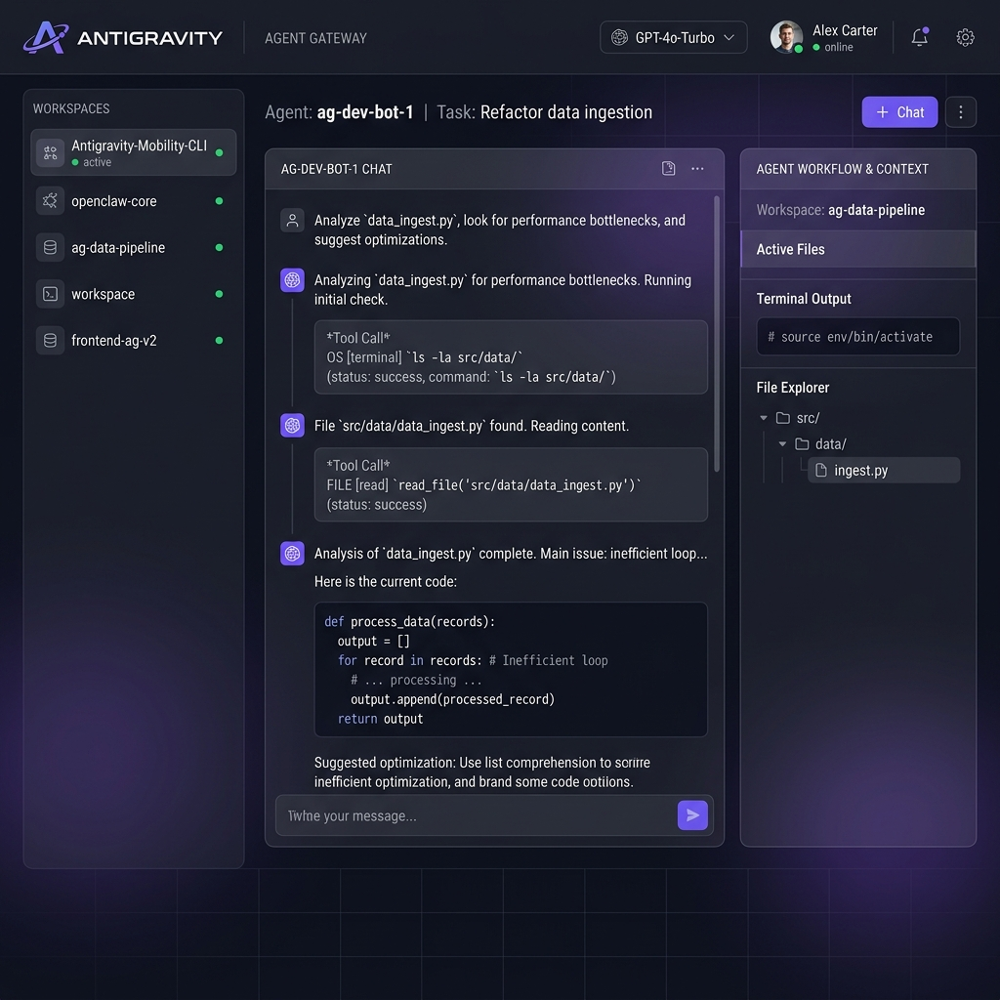
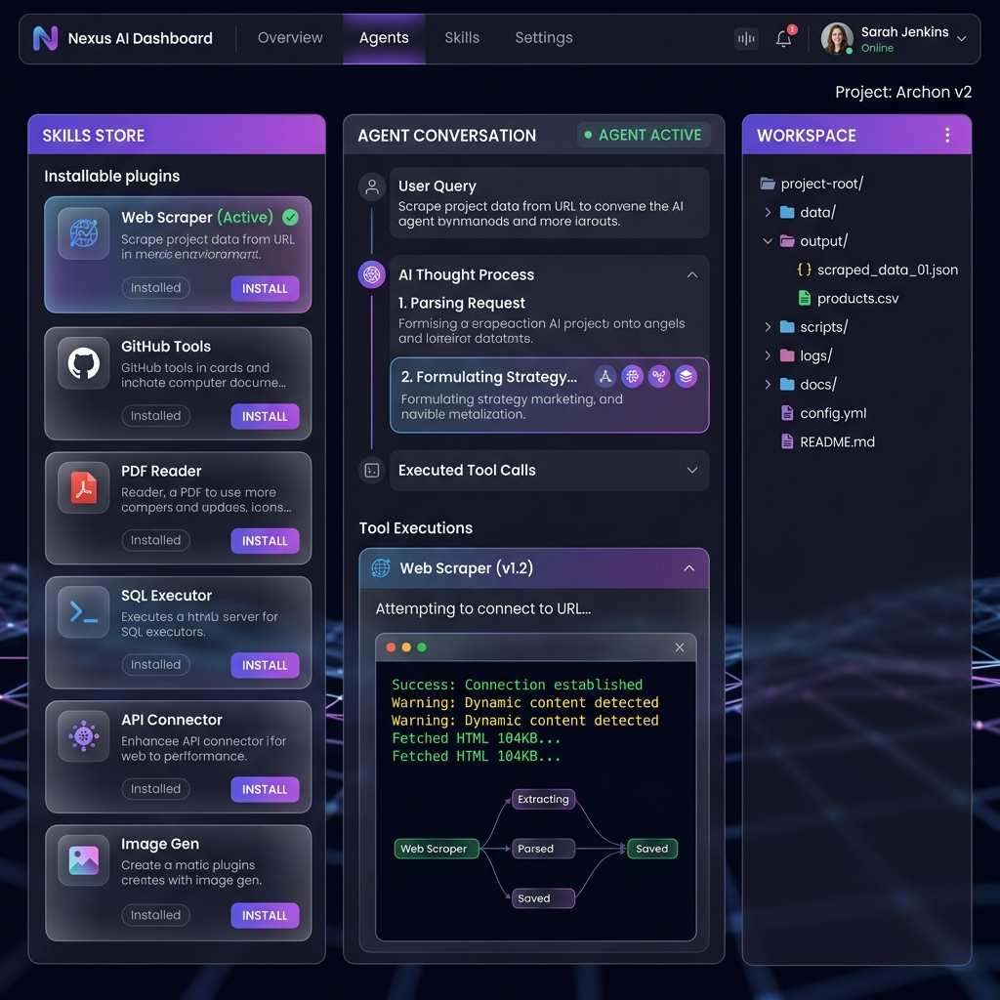
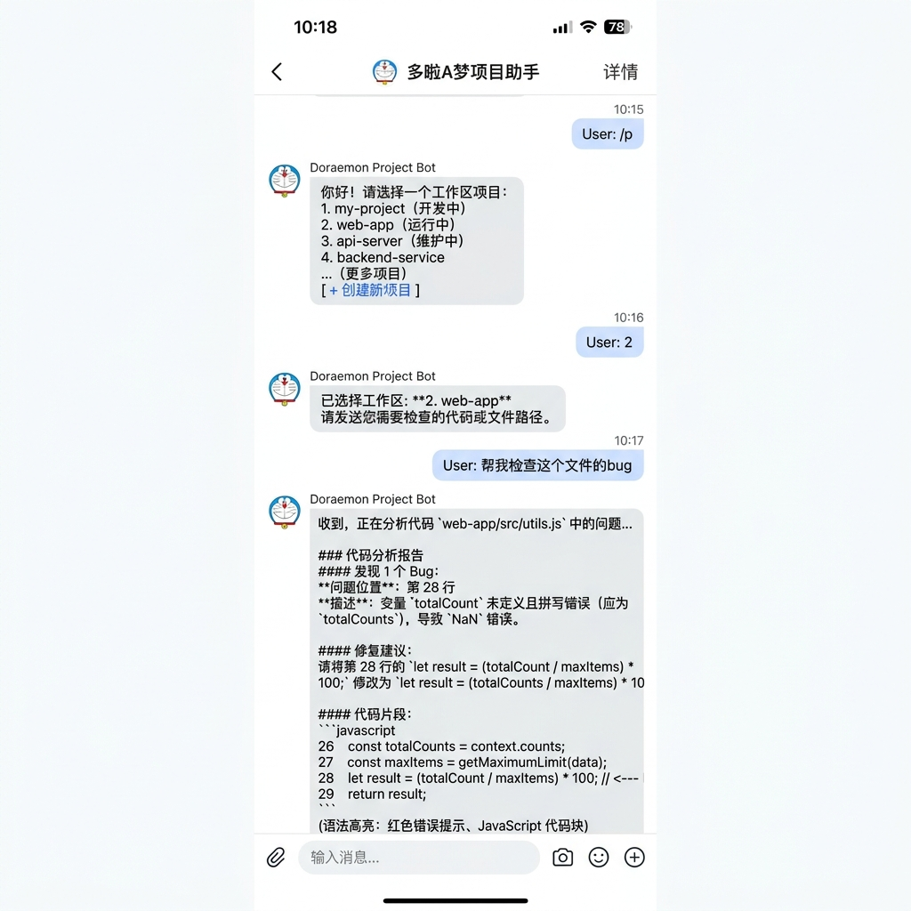

<div align="center">
  
  <h1>Antigravity Gateway</h1>
  <p><strong>将你的开发机变成 AI Agent 指挥中心</strong></p>
  <p>一个统一管理本地所有 AI 智能体的 Web 控制台，支持多工作区隔离、飞书远程协同、Skills 插件生态和全局知识库。</p>

  <p>
    <a href="#-快速安装"></a>
    <a href="https://github.com/Truthan49/Antigravity-Everywhere/issues"></a>
    <a href="https://github.com/Truthan49/Antigravity-Everywhere/blob/main/LICENSE"></a>
    
    
  </p>
</div>

---

<p align="center">
  
</p>

## 🎯 它能帮你解决什么？

| 痛点 | Antigravity 的方案 |
|------|-------------------|
| 本地 Agent 都在终端里跑，满屏日志看不清 AI 在干嘛 | **可视化工作台**：Chat 界面完整展示思考链、工具调用、终端输出 |
| 多个项目的 AI 上下文混在一起 | **多工作区隔离**：每个项目独立的语言服务、会话历史、工作流配置 |
| 离开电脑就无法和 Agent 交互 | **飞书移动协同**：在手机上远程操控工位电脑上的 Agent，支持项目创建和任务委派 |
| 给 AI 装工具需要手写几百行代码 | **Skills 插件商店**：25,000+ 现成工具一键安装，AI 自动调用 |
| 多个项目重复粘贴同样的提示词 | **全局知识库**：上传一次公司规范文档，所有项目的 Agent 共享调取 |

---

## ✨ 核心功能

### 💻 桌面可视化 Agent 工作台

不再是黑盒。在浏览器里清晰看到 Agent 的完整工作过程：

- **思考链（Thoughts）** — 看到 AI 正在分析什么、计划做什么
- **工具调用** — 实时显示文件读写、命令执行、网页搜索等操作
- **内嵌终端** — `npm run build` 等命令的彩色输出直接内联在聊天流中
- **多模型切换** — 顶部下拉菜单一键切换 Gemini / Claude / GPT 系列模型
- **Artifact 预览** — Agent 生成的代码差异、Markdown 文档实时渲染

### 📁 多工作区智能路由

<p align="center">
  
</p>

- 自动发现本地所有运行中的 Antigravity 语言服务实例
- 每个工作区拥有独立的 Agent 进程、会话历史和 gRPC 连接
- 智能 Owner Mapping — 根据工作区匹配自动将消息路由到正确的服务器
- 支持 Playground（沙盒）模式快速测验想法

### 📱 飞书移动端协同

<p align="center">
  
</p>

通过飞书机器人，在手机上远程控制工位电脑上的 Agent：

| 指令 | 功能 |
|------|------|
| `/new` `/p` | 查看并切换工作区，或创建新项目 |
| `/history` `/h` | 恢复近期的历史会话 |
| `/model` `/m` | 切换全局默认 AI 模型 |
| `/usage` `/u` | 查询过去 30 天的 Token 消耗量 |

**飞书独有能力：**
- 🚀 **一键创建项目** — 选择 Standard / GSD / Superpowers 研发模式，自动初始化项目结构并激活 Agent
- 🤖 **专属机器人委派** — 检测到工作区已绑定专属 Bot 时，自动提供切换选项
- 📊 **富文本回传** — Markdown 代码高亮、工具调用详情以结构化卡片形式展示
- 🔗 **内网穿透** — 内置 Cloudflare Tunnel 配置，无需公网 IP 即可远程协同

### 🧩 Skills 插件生态

- **25,000+ 现成工具** — 接入腾讯 SkillHub，搜索"GitHub 操作"、"网页爬虫"、"PDF 阅读" 等
- **一键安装** — 点击安装后 Agent 自动获得新能力
- **本地缓存** — 插件商店秒开，0 延迟浏览
- **自定义 Skills** — 支持项目级和全局级的自定义技能声明

### 🧠 全局知识库 & 工作流

- **共享文档** — 上传《代码规范》《API 文档》到全局知识库，所有工作区的 Agent 共享调取
- **自定义工作流** — 把 "代码审查→测试→构建→部署" 编排成标准流程，Agent 一键执行
- **自定义规则（Rules）** — 为 Agent 设定全局行为约束（编码风格、安全规范等）

### 📊 Token 消耗监控

- 30 日趋势折线图，分模型统计用量
- 请求成功/失败比例可视化
- API 费用一目了然，再也不怕跑超额度

---

## 🏗️ 系统架构

```
┌─────────────────────────────────────────────────────────┐
│                   Antigravity Gateway                    │
│                   (Next.js 15 + React)                   │
├──────────┬──────────┬──────────┬──────────┬──────────────┤
│  Web UI  │ REST API │ WebSocket│  Feishu  │   Tunnel     │
│  (SPA)   │ (15 routes) │ (live) │   Bot    │ (Cloudflare) │
└────┬─────┴────┬─────┴────┬─────┴────┬─────┴──────┬───────┘
     │          │          │          │             │
     ▼          ▼          ▼          ▼             ▼
┌─────────────────────────────────────────────────────────┐
│              Bridge Layer (gRPC + Discovery)             │
│  • Auto-discover language_server processes (ps + lsof)   │
│  • CSRF token management                                │
│  • Smart owner mapping (workspace ↔ server routing)      │
│  • Short ID → Full UUID resolution                       │
└────────────────────────┬────────────────────────────────┘
                         │ gRPC (Connect Protocol / JSON)
     ┌───────────────────┼───────────────────┐
     ▼                   ▼                   ▼
┌──────────┐       ┌──────────┐       ┌──────────┐
│ LS: Proj A│       │ LS: Proj B│       │ LS: Proj C│
│ port:50494│       │ port:58241│       │ port:58231│
└──────────┘       └──────────┘       └──────────┘
  Antigravity Language Server instances (per workspace)
```

**技术栈：**
- **前端**：Next.js 15 (App Router) + React 19 + TailwindCSS
- **后端**：Next.js API Routes + gRPC (Connect Protocol) + WebSocket
- **数据**：SQLite (Antigravity state.vscdb) + 本地 JSON 缓存 + Protobuf
- **通信**：飞书 WebSocket SDK + Cloudflare Tunnel
- **运行时**：Node.js 18+ / macOS / Linux

---

## 🚀 快速安装

### 前置要求

- [Antigravity](https://antigravity.dev) 桌面应用已安装并登录
- Node.js ≥ 18
- macOS 或 Linux

### 一键安装

```bash
curl -fsSL https://raw.githubusercontent.com/Truthan49/Antigravity-Everywhere/main/install.sh | bash
```

> 脚本会自动：拉取最新代码 → 安装依赖 → 配置后台服务 → 启动 Gateway

安装完成后访问 **http://localhost:3000** 即可使用。

### 手动安装

```bash
git clone https://github.com/Truthan49/Antigravity-Everywhere.git
cd Antigravity-Everywhere
npm install
npm run dev
```

---

## 🔄 更新到最新版本

```bash
cd ~/Antigravity-Everywhere && git pull origin main && npm install && npm run dev
```

> 如果你使用的是后台服务模式（通过 install.sh 安装），更新后需要重启服务：

```bash
cd ~/Antigravity-Everywhere && git pull origin main && npm install
# 重启后台服务
launchctl stop com.antigravity.gateway 2>/dev/null
launchctl start com.antigravity.gateway 2>/dev/null
# 或直接前台运行
npm run dev
```

---

## ⚙️ 配置指南

### 飞书机器人

1. 在 [飞书开放平台](https://open.feishu.cn) 创建自建应用
2. 获取 `App ID` 和 `App Secret`
3. 在 Gateway WebUI 左下角点击 ⚙️ → 「飞书配置」填入凭证
4. 启动后即可在飞书中与机器人对话

### 内网穿透（远程访问）

1. 在 Gateway WebUI 左下角点击 🔗 → 「Tunnel 配置」
2. 填入 Cloudflare Tunnel Token
3. 启动后即可通过公网域名访问 Gateway

### 全局 Skills / 工作流 / 规则

- **Skills**：WebUI 侧边栏 → 「技能」选项卡 → 导入或从 SkillHub 安装
- **Workflows**：WebUI 侧边栏 → 「工作流」选项卡 → 创建自定义流程
- **Rules**：WebUI 侧边栏 → 「规则」选项卡 → 配置 Agent 行为约束

---

## 🗑️ 卸载

```bash
curl -fsSL https://raw.githubusercontent.com/Truthan49/Antigravity-Everywhere/main/uninstall.sh | bash
```

卸载脚本会引导你选择是否保留历史配置文件，以便未来恢复。

---

## 📄 API 接口一览

Gateway 暴露以下 REST API（默认端口 3000）：

| 路径 | 方法 | 说明 |
|------|------|------|
| `/api/me` | GET | 当前用户信息与模型配额 |
| `/api/servers` | GET | 已发现的语言服务实例 |
| `/api/workspaces` | GET | 工作区列表（自动过滤已删除的目录） |
| `/api/conversations` | GET/POST | 会话列表 / 创建新会话 |
| `/api/conversations/[id]/send` | POST | 发送消息到指定会话 |
| `/api/conversations/[id]/steps` | GET | 获取会话步骤详情 |
| `/api/conversations/[id]/cancel` | POST | 取消正在执行的任务 |
| `/api/models` | GET | 可用模型列表与配额 |
| `/api/skills` | GET | 已安装的 Skills 插件 |
| `/api/workflows` | GET | 工作流列表 |
| `/api/knowledge` | GET/POST | 全局知识库管理 |
| `/api/analytics` | GET | Token 消耗统计 |
| `/api/feishu/[...]` | * | 飞书 Webhook 端点 |

---

## 🤝 参与共建

欢迎提交 Issue 或 Pull Request！我们特别期待以下方向的贡献：

- 🔌 更多 IM 平台适配（企业微信 / 钉钉 / Slack）
- 🧩 自定义 Skills 开发文档与示例
- 🌍 国际化（i18n）
- 📱 PWA 移动端优化

---

<div align="center">
  <sub>Built with ❤️ by <a href="https://github.com/Truthan49">Truthan49</a></sub>
</div>
